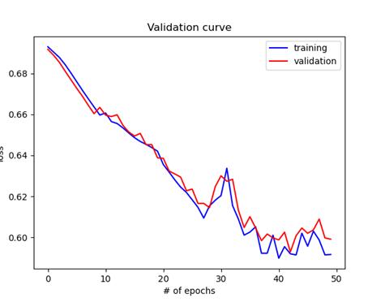
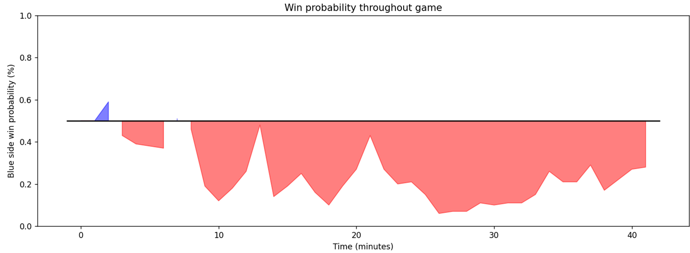

# Deep learning algorithms applied on eSport games

## Intro
Experimenting with Recurring Neural Networks (RNN) to demonstrate the power of predicting time series data on eSports games,
more specifically, League of Legends.

A research paper by Hitar-García & et al (https://ieeexplore.ieee.org/document/9720122/) has demonstrated that RNN has the highest theoretical
test accuraccy compared to the existing deployment by the game's creator, which uses XGboost.

This model also scrapes data from https://gol.gg to extract professional matches and predict the outcome of the match.

## Outcome
Cross-validation found that 5 layers with 128 interconnected node had the highest test accuracy and was chosen as the final model.

## Demonstration
Choosing a random game and extracting the game data, we observe the following graph.

## How to use
To run my model, simply run `predict.py` and enter the game you wish to analyse. To train your own model, run `train.py` and enter your own custom parameters into the model.